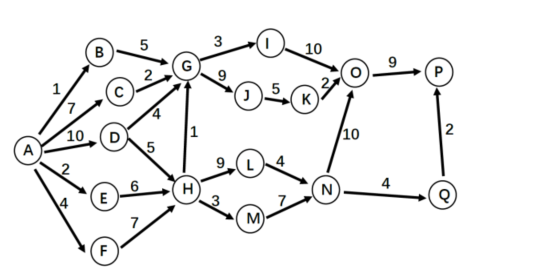
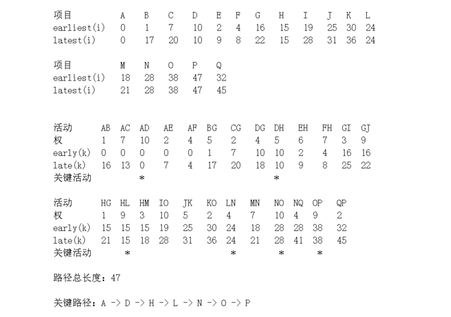
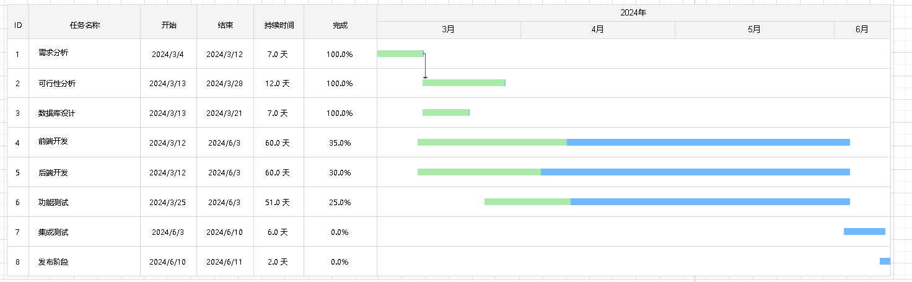

# 实验五 理解活动图，项目过程跟踪工具，人力资源组织结构
## 实验目的
1. 深入理解项目活动图。
2. 练习项目跟踪工具的使用。
3. 讨论人力资源管理、组织结构。

## 实验内容
1. 下图是一个软件开发项目的活动图，边长代表天数。请分析在图上标出每一个活动的最早开始时间、最晚开始时间和时差。然后找出关键路径和其总长度。

 

 

2. 练习项目跟踪工具的使用，如用甘特图记录跟踪项目过程。 
下图为我们组软件开发项目的甘特图： 
 

3. 调研国内外软件开发团队组织结构和工作方式对比。
   
    分工调研国内与国外软件开发团队的管理方式对比（如：996工作制）。 
    从个人角度，你最喜欢的工作方式、工作环境条件、可接受的约束等是什么？  
    从团队项目管理角度，你认为最有效的项目组工作管理方式是什么？ 

    在调研国内与国外软件开发团队的管理方式对比时，可以发现两者在多个方面存在显著差异，特别是工作时间制度上。以996工作制为例，这种工作制在我国的一些企业中被广泛采用，指的是每周工作6天，每天从早上9点到晚上9点的工作模式。然后在国外，特别是发达国家，这样的工作时间制度并不常见，他们更重视员工的工作与生活的平衡，提倡灵活的工作时间与远程办公。 

    从个人角度来看，我最喜欢的工作方式是具有一定自主性和灵活性的。我喜欢能够自行安排工作时间和地点，以便更好地平衡工作和生活。同时，也希望能有一个舒适、安静的工作环境，这样有利于集中精力进行工作。至于可接受的约束，主要是时间约束和薪资约束，一方面需要在工作和生活之间合理分配时间，另一方面也需要确保收入能够满足生活需求。 

    从团队项目管理角度来看，我认为最有效的项目组工作管理方式应该是以目标为导向，同时注重团队沟通和协作。首先，一个团队应该要先设定明确的项目目标和里程碑，确保每个团队成员都清楚自己的的职责和期望成果。其次，一个团队要建立良好的沟通渠道，团员成员之间要多进行沟通和讨论问题，以便及时发现问题并共同解决。此外，采用敏捷开发等灵活的项目管理方法，可以更好地应对项目中的不确定性和变化。 
 
    在对比国内外软件开发团队的管理方式时，我们可以发现国外团队更注重员工的个人发展和工作满意度，而国内团队则可能更加注重工作效率和产出。然而。随着全球化和信息化的发展，越来越多的国内企业开始认识到员工的重要性和价值，也逐渐转向更加人性化、科学化的管理方式。

    其中Documents目录下开发进度.md文件中记录了项目及小组每个人的进度表。