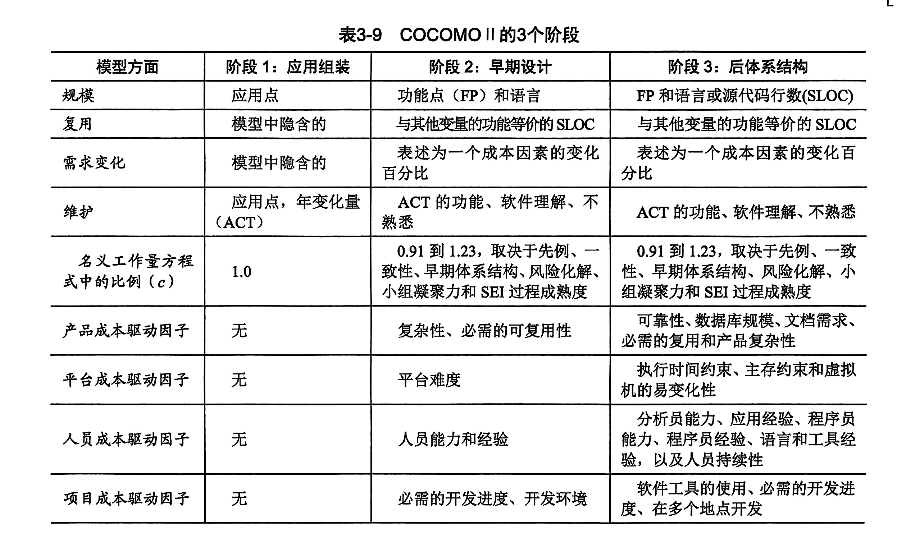
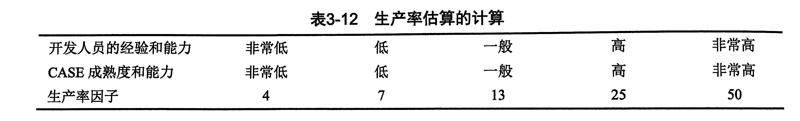

# 实验六  工作量估算，风险管理，软件需求规格说明SRS（1）

## 实验目的：
1.  工作量估算
2.  风险管理
3.  学习软件需求规格说明SRS文档的要求和结构

## 实验内容：

### 1.工作量估算：
**1. ch3 习题12**
```
很多项目经理根据过去项目中程序员的生产率来计划项目的进度，生产率通常根据单位时间的单位规模来测量。
例如，一个组织机构可能每天生产300行代码或每月生产1200个应用点。用这种方法测量生产率合适吗?
根据下列事项讨论生产率的测度:
· 用不同的语言实现同样的设计，可能产生的代码行数不同。
· 在实现开始之前不能用基于代码行的生产率进行测量。
· 程序员可能为了达到生产率的目标而堆积代码。
```

**讨论结果：**
&ensp;&ensp;&ensp;&ensp;我们小组首先就题目提到的三个事项进行了分析，讨论了这三种情况对生产率的影响：
1. **不同语言实现相同设计可能产生不同数量的代码行数：** 
   生产的代码行数受到所使用的编程语言和开发工具的影响。有些语言可能更简洁，能够用更少的代码来实现相同的功能。因此，仅仅依赖代码行数来衡量生产率可能会误导，因为这并不一定反映出程序员的工作效率或项目的质量。
2. **无法在实现开始之前使用基于代码行的生产率进行测量：** 
   在项目开始阶段，往往还没有实际的代码可供测量，因此无法依赖代码行数来规划项目进度。此时，更适合的是依据需求分析、设计和其他前期工作来制定项目计划。
3. **程序员可能为了达到生产率目标而堆积代码：** 
   如果项目经理仅仅关注代码行数或应用点等指标，程序员可能会为了满足这些指标而堆积代码，而不是专注于编写简洁、高效的代码。这可能会导致代码质量下降、可维护性降低以及未来项目阶段的问题增加。

**结论**
&ensp;&ensp;&ensp;&ensp;**经由讨论，我们的结论为：** 为了更准确地衡量生产率，项目管理者应该考虑更全面的指标，包括但不限于：**功能完成情况、质量指标、工作效率、项目风险**等。同时，要意识到生产率不仅仅是产出量的问题，还包括**产出质量、适时性**等因素。

**2. 估算自己项目的初始工作量。**
&ensp;&ensp;&ensp;&ensp;我们参考课本第94页皮卡地里电视广告销售系统按COCOMOII的工作量模型进行工作量估算的例子，结合课本79-80页的相关表格（如下两表所示），对我们项目的初始工作量进行了评估。


&ensp;&ensp;&ensp;&ensp;首先，我们分析了项目可能存在的应用点，建立了如下应用点评估表格：
| 应用点名称 | 所属需求 | 复杂性 | 权值 |
|-----|-----|-----|-----|
| 用户登录与注册功能 | 用户管理 | 简单 | 1 |
| 查看商城首页功能 | 用户购物 | 简单 | 1 |
| 查看用户个人主页功能 | 用户管理 | 简单 | 1 |
| 查看修改用户个人信息功能 | 用户管理 | 简单 | 1 |
| 查看管理商家店铺功能 | 用户管理 | 简单 | 1 |
| 查看个人购物车功能 | 用户管理 | 简单 | 1 |
| 商品详情页面 | 商家管理 | 简单 | 1 |
| 商家管理页面 | 商家管理 | 简单 | 1 |
| 行9                | 商家管理 | 简单   | 数据 |
| 行10               | 商家管理 | 简单   | 数据 |

&ensp;&ensp;&ensp;&ensp;通过此表格，我们把最右边一列的所有加权值相加，生成了应用点的计数 **(NOPS)** ，其值为**此处等各位大哥写完表格后填写**。假定开发人员具有低的经验和低的CASE熟练度，表2显示了这种情况的生产率评分是**7**。因此，用COCOMO2模型可以得到构建网上商城系统的估算工作量是NOP除以生产率评分，即**此处等各位大哥写完表格后填写**人月。
#### <span style="color:red;"><b>说明：</b></span>
&ensp;&ensp;&ensp;&ensp;实验报告的要求是估算初始工作量，我感觉到这已经可以了，后续根据早期设计模型和后体系结构模型对工作量的修改没有写。


### 2. 风险管理
**1. ch3 习题11 （小组讨论）**
```
即使你在做学生项目，在按时完成项目方面也有极大的风险。分析一个学生软件开发项目并列出其中的风险。风险暴露是什么？可以使用什么技术来减轻各种风险？
```
&ensp;&ensp;&ensp;&ensp;经过我们的讨论，我们认为学生软件开发项目可能存在的风险包括但不限于以下几方面：
1. **技术能力不足：**
   - **风险：** 学生可能缺乏足够的技术能力来完成项目中所需的开发任务。
2. **项目范围不清晰：**
   - **风险：** 项目的需求和范围没有明确定义，导致项目方向不明确、需求变更频繁等问题。
3. **时间管理不足：**
   - **风险：** 学生可能无法有效地管理项目进度，导致延迟交付。
4. **团队沟通问题：**
   - **风险：** 团队成员之间的沟通不畅，导致信息交流不足、任务分配不明确等问题。
5. **个人问题：**
   - **风险：** 团队成员可能面临个人问题，如健康问题、家庭问题等，影响其工作效率和项目进度。

&ensp;&ensp;&ensp;&ensp;**风险暴露**是指风险在项目实施过程中显露出来的情况。**根据课本第84页的定义**，风险暴露可以**通过将风险影响和风险概率相乘得到**，从而量化我们识别的风险所造成的影响。
&ensp;&ensp;&ensp;&ensp;总的来说，可以用以下3种策略来**降低风险**：
```
1. 通过改变性能或功能需求，避免风险。
2. 通过把风险分配到其他系统中，或者购买保险以便在风险成为事实时弥补经济上的损失，从而转移风险。
3. 假设风险会发生，接受并用项目资源控制风险。
```
**具体到该问题中**，减少风险的措施可以如下所示：
1. **技术能力不足：**
提供技术培训、分配导师或指导老师、使用简化的开发工具和技术、鼓励团队合作和知识分享等。
2. **项目范围不清晰：**
在项目启动阶段明确定义项目范围和需求、采用敏捷开发方法、实行有效的变更管理等。
3. **时间管理不足：**
制定详细的项目计划、设定里程碑、定期跟踪和评估项目进度、灵活调整计划等。
4. **团队沟通问题：**
建立有效的沟通渠道、定期召开团队会议、使用协作工具和沟通平台、鼓励开放和透明的沟通文化等。
5. **个人问题：**
提供支持和帮助、灵活调整工作安排、合理分配任务、建立备用计划等。

**2. 分析自己项目中可能存在的风险，并进一步细化风险管理（做出风险分级及应对预案）。**

&ensp;&ensp;&ensp;&ensp;针对我们的项目实际需求，我们小组讨论列出了一些**可能存在的风险**以及针对这些风险的**风险管理措施（应对预案）**，并对各风险进行了**风险分级**：

1. **技术风险：**
   - **风险描述：** 小组成员可能缺乏足够的技术能力来实现项目需求，或者项目所需的技术可能超出了小组成员的能力范围。
   - **风险管理：** 提前进行技术评估，确定项目所需的技术栈和工具；提供技术培训和支持；在项目启动前规划技术研究和学习时间；考虑引入技术专家或顾问参与项目。

2. **需求变更风险：**
   - **风险描述：** 需求可能会频繁变更，导致项目范围不清晰、进度延迟。
   - **风险管理：** 在项目启动阶段明确定义项目范围和需求；实施有效的变更管理流程，确保任何需求变更都经过充分评估和批准；采用敏捷开发方法，灵活应对需求变更。

3. **沟通风险：**
   - **风险描述：** 团队成员之间的沟通不畅，信息传递不及时或不清晰，导致任务分配不明确、进度延误等问题。
   - **风险管理：** 建立有效的沟通机制，包括定期团队会议、沟通平台、邮件通知等；鼓励开放和透明的沟通文化，提倡团队成员之间的积极交流；确保所有重要信息都被记录和传达给所有团队成员。

4. **时间管理风险：**
   - **风险描述：** 团队可能无法有效地管理项目进度，导致任务延期、项目推迟交付。
   - **风险管理：** 制定详细的项目计划，包括明确的任务分配和里程碑；定期跟踪和评估项目进度，及时调整计划；灵活应对变化，合理安排项目资源。

**风险分级**(设置优先级，优先级越高越被优先管理)：技术风险＞时间管理风险＞沟通风险＞需求变更风险

### 3. 学习国标中的文档11《软件需求规格说明SRS》，了解文档的要求和结构及与其他相关文档 （07,08,12,17等）的关系。


- **要求：**
  - **清晰性（Clarity）：** 文档应该明确、清晰地描述系统的需求，避免歧义和模棱两可的描述。
  - **完整性（Completeness）：** 文档应该包含系统的所有主要功能和非功能需求，确保覆盖所有相关方的期望。
  - **一致性（Consistency）：** 文档中的各个部分应该相互一致，避免出现矛盾或冲突的描述。
  - **可追踪性（Traceability）：** 需求应该是可追踪的，即能够追溯到其来源（如需求提出者、系统设计文档等）和影响（如测试用例、变更请求等）。
  - **可验证性（Verifiability）：** 需求应该是可验证的，即能够通过测试或审查来验证是否满足了需求。

- **结构：**
  - **引言（Introduction）：** 简要介绍项目的背景、目的、范围和阅读指南等信息。
  - **总体描述（Overall Description）：** 对系统进行总体描述，包括系统的功能、用户特征、约束条件等。
  - **特定需求（Specific Requirements）：** 对系统功能和非功能需求进行详细描述，包括功能性需求、性能需求、接口需求等。
  - **附录（Appendix）：** 包含了补充信息，如术语表、缩写词表等。

- **与其他标准文档的关系：**
  - **《系统需求规格说明(SSS)》：** 《软件需求规格说明(SRS)》通常涵盖了系统级别的需求，而《系统需求规格说明(SSS)》则更加细化，具体到了子系统或模块级别。
  - **《接口需求规格说明(IRS)》：** 《接口需求规格说明(IRS)》定义了系统与外部系统或组件之间的接口需求，通常包括数据接口、硬件接口、软件接口等。
  - **《数据需求说明(DRD)》：** 《数据需求说明(DRD)》主要描述了系统中的数据需求，包括数据结构、数据格式、数据存储等方面。
  - **《软件配置管理计划(SCMP)》：** 《软件配置管理计划(SCMP)》定义了对软件配置管理的要求和流程，包括配置项标识、变更控制、版本管理等内容。与《软件需求规格说明(SRS)》的关系在于，配置管理计划中可能包括需求的变更控制和配置项的标识等内容，以确保对需求的管理和追踪。

### 项目跟踪
&ensp;&ensp;&ensp;&ensp;建立能反映项目及小组每个人工作的进度、里程碑、工作量的跟踪图或表，每周更新。更新地址为https://github.com/Mowalen/BXX_dg/blob/main/Documents/%E5%BC%80%E5%8F%91%E8%BF%9B%E5%BA%A6.md

