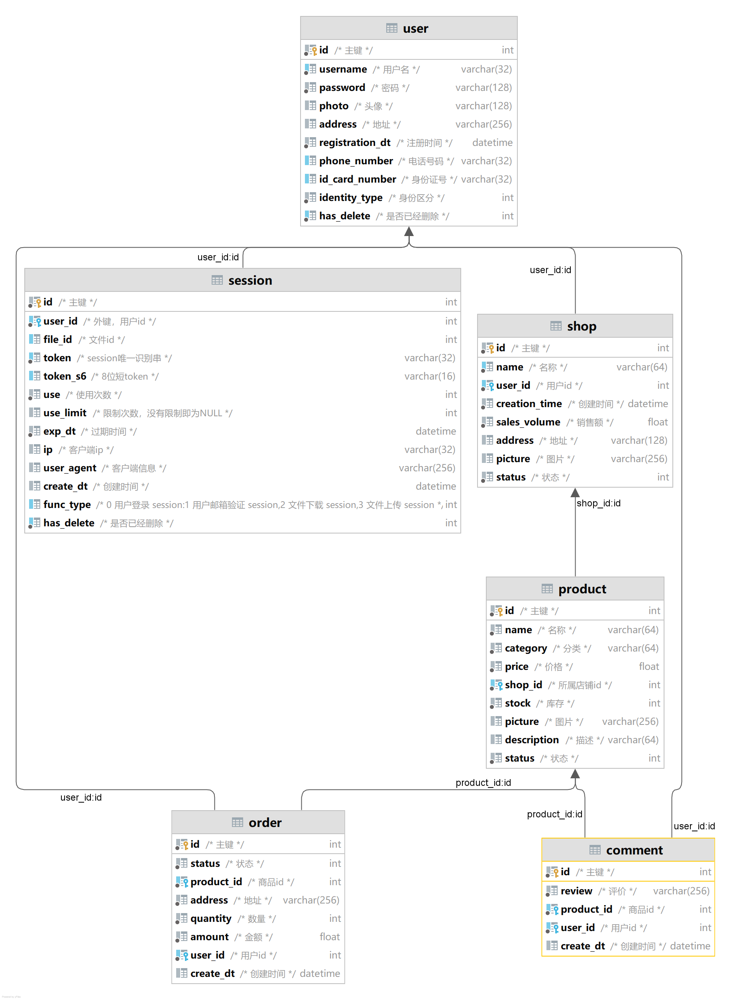

# 实验7
## 1.搜集案例
见当前文件夹下的"SRS案例"目录
## 2.SRS草稿
完成中，后期上传
## 3.《软件需求规格说明(SRS)》文档和Volere需求规格说明书模板对比
### 共同点
1. 文档目的：两者均旨在详尽描述软件系统的需求，确保各方对系统预期行为有共同的理解，为后续设计、开发、测试和验证活动提供基础。
2. 全面性：两个模板都包含了广泛的需求类别，如功能性需求、非功能性需求、运行环境需求、资源需求、约束条件、用户特点、外部接口需求、内部接口需求、数据需求、安全性和隐私性需求、性能需求、质量因素、故障处理、算法说明、人员和培训需求等。
3. 结构化方法：两者都采用了高度结构化的格式，以章节和子章节的形式组织内容，确保需求的层次分明和逻辑连贯。
4. 需求可追溯性：都强调了需求的可追溯性和可测试性，要求对每个需求进行明确的标识和描述，便于跟踪和验证。
5. 文档完整性：除了需求本身，还包括文档的范围、引用文件、系统概述、约束条件、合格性规定等内容，确保需求规格说明书的全面性。
### 区别和特点：
1. 粒度和深度：Volere需求规格说明书模板提供了更为详细的细分，不仅涵盖了软件功能需求，还细致地划分了项目驱动、利益相关者、项目限制条件、命名惯例、相关事实和假定等多个层面的内容。而《软件需求规格说明(SRS)》文档虽然也有类似的细分，但在某些方面不如Volere模板深入细致。
2. 需求分类：Volere模板按照需求的不同类型进行了细化，如功能性需求、非功能性需求、项目驱动、项目限制条件、项目问题等，进一步帮助用户理解和组织需求，尤其强调了验收条件和需求项框架的构建，使得需求更具可测试性。
3. 需求模板的专业性：Volere模板更加侧重于实际需求分析过程的引导，例如一开始就强调测试需求的编写，提出了验收条件的概念，并提供了一个名为“白雪卡”的需求项框架，用于标准化地编写原子需求。
4. 需求发现与组织：Volere模板提供了更多的辅助工具和方法论，如Snow Card需求项框架、企业需求和假定的识别、以及对不同类型利益相关者的考虑等，帮助用户更好地发现、组织和沟通需求。
5. 可定制性：Volere模板提供了可下载的Excel表格等工具，便于用户根据自己的需求调整和扩展，而且鼓励用户在使用时结合流行的需求管理工具，并支持与其他需求工具的整合。
6. 范例和场景：Volere模板在介绍各部分需求时，给出了丰富的实例和应用场景，为用户提供更直观的理解和写作参考。
## 4.UML图模型如下

